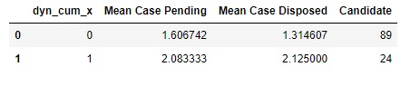
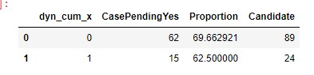
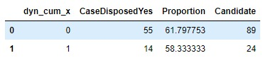

---

```{r set up, warning=FALSE, include=FALSE, message= FALSE}
knitr::opts_chunk$set(cache = FALSE ,echo = FALSE, message=FALSE, warning = FALSE,fig.width = 16/2, fig.height = 9/2)
library(tidyverse)
library(data.table)
library(knitr)
library(kableExtra)
library(scales)
library(gridExtra)
library(stargazer)
library(ggbump)
library(cowplot)
library(colorspace)
library(ggthemes)
library(DT)
install.packages("data.table")

library(data.table)
library(widgetframe)
`%!in%` = Negate(`%in%`)
select <- dplyr::select
```
---
# AE LEVEL 2012-2017
```{r}

```

# CASE PENDING PROPOPRTION
```{r}

```

# CASE DISPOSED PROPOPRTION
```{r}

```

## GE LEVEL PAN INDIA
## Cases 2009-2014

```{r}
knitr::include_graphics("t1.png")
```

# PROPORTION CASE PENDING
```{r}
knitr::include_graphics("t2.png")
```

# PROPORTION CASE DISPOSED
```{r}
knitr::include_graphics("t3.png")
```

# GE LEVEL CASES 2014-2019
```{r}
knitr::include_graphics("t4.png")
```

# PROPORTION CASE PENDING
```{r}
knitr::include_graphics("t5.png")
```

# PROPORTION CASE DISPOSED
```{r}
knitr::include_graphics("t6.png")
```

# GE LEVEL CASES 2009-2014-2019
```{r}
knitr::include_graphics("t7.png")
```

# PROPORTION CASE PENDING
```{r}
knitr::include_graphics("t8.png")
```


# PROPORTION CASE DISPOSED
```{r}
knitr::include_graphics("t9.png")
```

# MODEL CASE DISPOSED(2009-2019)


```{r,warning=FALSE,results='asis',echo=FALSE,include=TRUE,message=FALSE}
library(plm)
library(stargazer)
library(lfe)
firstphase<-readr::read_csv("C:/Users/Jatin/Downloads/JatinCPR/Jatin NEW CPR/adr talha/crimetcpd.csv")

fit.felm<-felm(CaseDisposed~dyn+Incumbent+Contested+No_Terms|factor(state_name)+factor(Year_y),data=firstphase)

stargazer(fit.felm,column.labels=c("OLS"),
no.space=TRUE,align=TRUE,type = 'html',covariate.labels = ,add.lines=list(c('Year fixed effects', 'Yes','Yes','Yes'),c('State Fixed Effects', 'Yes','Yes','Yes')))
```
# MODEL CASE PENDING(2009-2019)


```{r,warning=FALSE,results='asis',echo=FALSE,include=TRUE,message=FALSE}
library(plm)
library(stargazer)
library(lfe)
firstphase<-readr::read_csv("C:/Users/Jatin/Downloads/JatinCPR/Jatin NEW CPR/adr talha/crimetcpd.csv")

fit.felm<-felm(CasePending~dyn+Incumbent+Contested+No_Terms|factor(state_name)+factor(Year_y),data=firstphase)

stargazer(fit.felm,column.labels=c("OLS"),
no.space=TRUE,align=TRUE,type = 'html',covariate.labels = ,add.lines=list(c('Year fixed effects', 'Yes','Yes','Yes'),c('State Fixed Effects', 'Yes','Yes','Yes')))
```

# CASE DISPOSED t-test
```{r}
knitr::include_graphics("t10.png")
```

# CAse Pending t-test
```{r}
knitr::include_graphics("t11.png")
